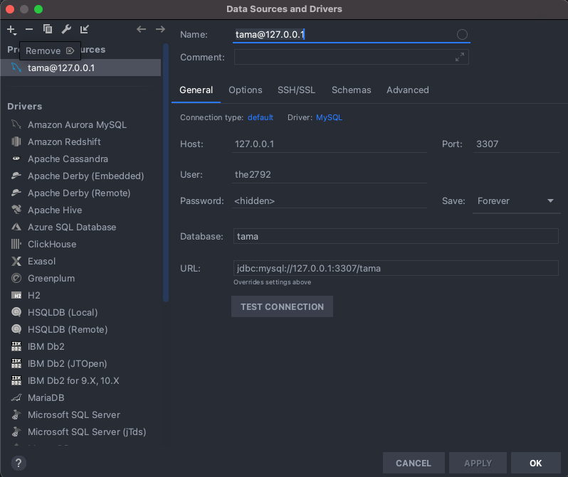

# db connect
## 1. docker-compose.yml 작성
```yaml
version: '3.3'
services:
  database:
    container_name: docker-local-mysql
    image: mysql:5.7
    volumes:
      - data:/var/lib/mysql
    restart: always
    command: --default-authentication-plugin=mysql_native_password
    ports:
      - 3307:3306
    environment:
      MYSQL_DATABASE: tama
      MYSQL_USER: the2792
      MYSQL_PASSWORD: canyou12
      MYSQL_ROOT_PASSWORD: canyou12
  adminer:
    image: adminer
    restart: always
    ports:
      - 8081:8080
volumes:
  data:
```
## 2. adminer 접속 
http://localhost:8081
> ref <br>
> https://stackoverflow.com/questions/57266703/cant-connect-to-mysql-database-using-adminer-and-docker-compose

## 3. datagrip 접속
