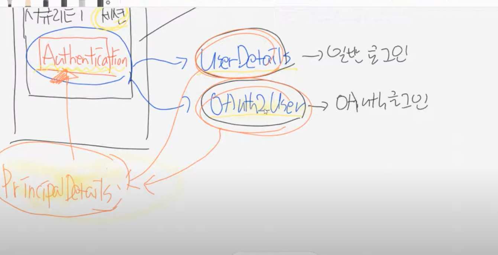

# security session

 > implements UserDetails, OAuth2User
 UserDetails, OAuth2User 를 implements 한다.
 Authentication 에는 UserDetails 객체와 OAuth2User 객체만 들어 올 수 있다.
 컨트롤러에서 사용할 때 타입을 2개 다 적어주기엔 공수가 많이 들기 때문에,
 하나의 부모객체를 두고, 이 안에 UserDetails, OAuth2User 객체를 두면, 부모객체만 사용하면 된다.
 물론 둘다 overriding 해야한다. 기능구현은 `PricipalDetails.java` 를 참고
